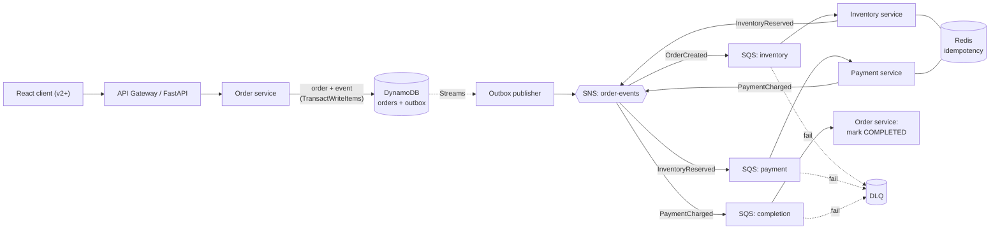

# Event-Driven Order Pipeline — Master Plan & Learning Guide

> A single source of truth for the whole project: the working method, the mentor role,
> every mandatory technology and concept, the architecture decisions taken so far, the
> environment setup, the versioned roadmap, and a coverage matrix that proves nothing is
> missed. This document is meant to be edited as the project evolves.

**Project repo:** `event-driven-order-pipeline`
**Nature:** A hands-on, incrementally-built POC for deep, practical learning of distributed
systems and applied AI. Learning depth is the goal — not shipping a product.

---

## Table of contents

1. [How to use this document](#1-how-to-use-this-document)
2. [Mentor role & working agreement](#2-mentor-role--working-agreement)
3. [The five-phase method](#3-the-five-phase-method)
4. [The explanation contract](#4-the-explanation-contract)
5. [Mandatory coverage checklists](#5-mandatory-coverage-checklists)
6. [Project overview](#6-project-overview)
7. [Architecture decisions log](#7-architecture-decisions-log)
8. [Architecture (v1)](#8-architecture-v1)
9. [Event envelope & contracts](#9-event-envelope--contracts)
10. [Happy-path flow, step by step](#10-happy-path-flow-step-by-step)
11. [Local environment setup](#11-local-environment-setup)
12. [Repository structure](#12-repository-structure)
13. [Versioned roadmap](#13-versioned-roadmap)
14. [Coverage matrix — nothing is missed](#14-coverage-matrix--nothing-is-missed)
15. [Applying the five phases to this project](#15-applying-the-five-phases-to-this-project)
16. [Glossary](#16-glossary)
17. [Open questions & next actions](#17-open-questions--next-actions)

---

## 1. How to use this document

- Read sections 2–5 once — they define *how* we work.
- Sections 6–10 are the *current* design (v1). They change as decisions change; when they
  do, update the [decisions log](#7-architecture-decisions-log).
- Section 11 gets you running locally.
- Sections 13–14 are the long game: what gets built when, and proof that every mandatory
  item is scheduled.
- Every explanation in our sessions follows the [explanation contract](#4-the-explanation-contract):
  Why, How, Tradeoffs, Alternatives, Production concerns.

---

## 2. Mentor role & working agreement

The assistant acts as: **Senior Staff Engineer, AWS Architect, Python Mentor, AI Architect,
and Technical Reviewer.**

Working rules:

- The goal is *understanding*, not just answers. Assume the reader is learning and wants depth.
- Do **not** dump complete solutions immediately. Move through the five phases.
- Implement **incrementally** — never generate huge code dumps. Small, reviewable pieces.
- Language: **Python**. Style: **clean architecture** (domain / application / adapters / api).
- Every non-trivial topic is explained with Why, How, Tradeoffs, Alternatives, and
  Production concerns.
- Honesty over convenience: if something is a forced fit or a simplification, say so.

---

## 3. The five-phase method

Every feature or component moves through these phases in order.

### Phase 1 — Architecture
- Explain requirements.
- Draw the architecture (Mermaid).
- Identify AWS services.
- Explain tradeoffs.
- Define events and contracts.

### Phase 2 — Design
- Design the folder structure.
- Explain scaling.
- Explain failure scenarios.
- Explain idempotency.
- Explain checkpointing.
- Define monitoring.

### Phase 3 — Implementation
- Implement incrementally (no huge code dumps).
- Python.
- Clean architecture.

### Phase 4 — AI integration
For every feature, always ask:
- Can RAG help?
- Can an agent help?
- Should MCP be used?
- Should embeddings exist?
- Is semantic search useful?
- Can workflow orchestration improve this?

### Phase 5 — Production review
Review across:
- Security
- Cost
- Performance
- Reliability
- Maintainability

---

## 4. The explanation contract

For every concept or decision, the answer covers:

1. **Why** — the problem it solves and why it matters here.
2. **How** — the mechanism, concretely.
3. **Tradeoffs** — what we give up by choosing it.
4. **Alternatives** — what else could have been used, and why it wasn't.
5. **Production concerns** — what breaks at scale, and what to watch.

---

## 5. Mandatory coverage checklists

These are learning goals for the whole project (across all versions), not for v1 alone.
Section 14 maps each item to the version where it is introduced.

### Mandatory AWS services
- [ ] AWS SQS
- [ ] AWS SNS
- [ ] Kinesis
- [ ] Lambda
- [ ] CloudWatch
- [ ] ElastiCache
- [ ] S3
- [ ] OpenSearch
- [ ] API Gateway
- [ ] DynamoDB
- [ ] Elastic Beanstalk

### Mandatory AI concepts
- [ ] Prompt Engineering
- [ ] RAG
- [ ] Tokenization
- [ ] Embeddings
- [ ] Vector DB
- [ ] Semantic Search
- [ ] LangGraph
- [ ] MCP Servers
- [ ] AI Agents
- [ ] Tool Calling
- [ ] Context Engineering
- [ ] Memory
- [ ] Evaluation
- [ ] Guardrails
- [ ] Structured Output
- [ ] Multi-Agent Systems
- [ ] Knowledge Graphs
- [ ] AI Observability
- [ ] Agentic Workflows

### Mandatory engineering concepts
- [ ] Docker
- [ ] Event-Driven Architecture
- [ ] CQRS
- [ ] Retry
- [ ] Dead Letter Queue
- [ ] Saga
- [ ] Outbox Pattern
- [ ] Checkpointing
- [ ] Idempotency
- [ ] OpenTelemetry
- [ ] CI/CD
- [ ] Load Testing

---

## 6. Project overview

### What it is
An e-commerce order pipeline built as **event-driven microservices**. A customer places an
order; the order's journey (reserve inventory -> take payment -> complete) unfolds as a
chain of events, where each service reacts to the previous service's event. There is **no
central orchestrator** in v1 — this is *choreography*.

### The real-world problem it solves
A single "Place Order" click hides several steps that live in separate services. Doing this
reliably is hard. The POC demonstrates the standard solutions to three real problems:

| Problem | What goes wrong | Pattern used |
| --- | --- | --- |
| Dual-write | The DB commits but the event is lost on crash | Outbox (on DynamoDB) |
| Double submit | A retry / double-click creates two orders or two charges | Idempotency |
| Transient failures | A service is briefly down and a message is dropped | Retry + DLQ |

### Why this shape
- Choreography keeps v1 simple and highly decoupled while still being a real production shape.
- Happy-path-only scope keeps the focus on the event backbone and the Outbox pattern.
- Building on DynamoDB from day one teaches the cloud-native transactional model directly.

---

## 7. Architecture decisions log

This section records decisions and any deviations from the generic plan. Update it whenever
a decision changes.

| # | Decision | Rationale | Supersedes |
| --- | --- | --- | --- |
| D1 | **Choreography, no saga orchestrator/state machine in v1** | Happy-path POC needs no central coordinator or compensation; services react to events. Simpler, more decoupled. | The earlier orchestration-based design |
| D2 | **Happy path only for the POC** | One successful end-to-end path is enough to demonstrate the backbone. No compensation/rollback yet. | — |
| D3 | **DynamoDB (emulator) is the transactional + outbox store; no RDBMS for outbox** | Learn the cloud-native model from the start: Outbox via `TransactWriteItems` + Streams. | Postgres-for-outbox from the generic toolset |
| D4 | **Clean architecture in all services** | Keep domain/application independent of infrastructure so emulator->AWS is a local change. | — |
| D5 | **Kinesis is an analytics lane, not the core order flow** | Orders are discrete business events (SNS/SQS). Kinesis fits high-volume streaming, replay, checkpointing — a parallel analytics lane. | Kinesis in the core flow |
| D6 | **Saga is deferred, not dropped** | Saga + compensation is a mandatory concept; it returns in a later hardening version that reintroduces an orchestrator. | — |
| D7 | **Observability: OpenTelemetry locally (Jaeger), CloudWatch/App Insights/Signals on AWS** | LocalStack doesn't fully emulate App Insights/Signals; OTel gives the same concepts locally and maps to AWS APM on deploy. | — |

> Note on the toolset list: `Postgres` remains in the generic environment list but is **not**
> used for the transactional/outbox store (see D3). It is only a candidate for a relational
> read-model if a future CQRS version needs one; otherwise DynamoDB projections / OpenSearch
> serve the read side. `MinIO` is the local stand-in for S3 and is optional until v4.

---

## 8. Architecture (v1)



**How the transports connect:** one SNS topic (`order-events`) fans out to three SQS queues.
Each queue subscribes with a **filter policy** so it only receives the one event type it
cares about. SNS broadcasts; each SQS queue is a durable, per-service inbox with retry + DLQ.

---

## 9. Event envelope & contracts

All messages (events, and later commands/replies) share one envelope. Payload is separate
from metadata.

```json
{
  "message_id": "msg_a1",
  "type": "OrderCreated",
  "version": "1.0",
  "occurred_at": "2026-06-23T10:00:00Z",
  "correlation_id": "ord_7f3a",
  "causation_id": "msg_prev",
  "payload": { }
}
```

- `correlation_id` (= the order id) stays constant across every message of one order — makes
  the whole journey traceable.
- `message_id` is unique per message — consumers use it to deduplicate (every transport here
  is at-least-once).
- `causation_id` points to the message that caused this one — builds a cause/effect chain.

### v1 events

```json
// OrderCreated.payload
{ "order_id": "ord_7f3a", "customer_id": "cust_42",
  "items": [{ "sku": "SKU-TEE-BLK-M", "qty": 2, "unit_price": 1500 }],
  "total": 3000, "currency": "PKR" }

// InventoryReserved.payload
{ "order_id": "ord_7f3a", "reservation_id": "rsv_88" }

// PaymentCharged.payload
{ "order_id": "ord_7f3a", "payment_id": "pay_55", "amount": 3000 }

// OrderCompleted.payload  (broadcast to outsiders: notifications, analytics)
{ "order_id": "ord_7f3a", "status": "COMPLETED" }
```

Contracts live in `libs/contracts/` and are imported by every service to prevent drift.

---

## 10. Happy-path flow, step by step

1. **Client -> API Gateway.** `POST /orders` with an `Idempotency-Key` header.
2. **Order service — idempotency check.** Look up the key in Redis; if seen, return the
   stored result; otherwise proceed.
3. **Order service — atomic write (Outbox).** In one DynamoDB `TransactWriteItems` call,
   write the order (`status = PENDING`) to the `orders` table **and** the `OrderCreated`
   event to the `outbox` table. Either both commit or neither does.
4. **Respond.** Return `201 { order_id, status: "PENDING" }` immediately; the rest is async.
5. **DynamoDB Streams -> Outbox publisher.** Streams on the `outbox` table deliver the new
   event to a publisher worker, which publishes it to SNS and marks the row published.
6. **SNS -> SQS (filter) -> Inventory service.** Filter `type=OrderCreated` routes it to the
   inventory queue. The service dedups, reserves stock, and emits `InventoryReserved`.
7. **SNS -> SQS (filter) -> Payment service.** Filter `type=InventoryReserved`. The service
   dedups, charges, and emits `PaymentCharged`.
8. **SNS -> SQS (filter) -> Order completion.** Filter `type=PaymentCharged`. The order
   service sets `status = COMPLETED`. (The `orders` table has a single writer: the order
   service.)

Status lifecycle: an order starts `PENDING` because downstream work hasn't happened yet, and
becomes `COMPLETED` at the end of the happy path. The system is **eventually consistent** by
design — this is a feature, not a bug.

---

## 11. Local environment setup

Goal: one `docker compose up` brings up a small local "cloud" on the laptop.

### Toolset (from the environment spec)
- **Docker / Docker Compose** — runs everything.
- **DynamoDB emulator** — transactional + outbox store (with Streams). Use `amazon/dynamodb-local`
  or LocalStack's DynamoDB.
- **LocalStack** — SNS + SQS (and later Kinesis, Lambda, CloudWatch).
- **Redis** — ElastiCache stand-in: idempotency keys + cache.
- **OpenSearch** — search + vector DB (v2+).
- **Ollama** — local LLM + embeddings (v2+).
- **MinIO** — S3 stand-in (optional, v4+).
- **FastAPI** — services.
- **React** — frontend (v2+).
- **Postgres** — listed but not used for outbox (see D3); only a possible relational
  read-model later.

### v1 infrastructure (compose sketch)

```yaml
services:
  dynamodb:
    image: amazon/dynamodb-local
    command: "-jar DynamoDBLocal.jar -sharedDb"
    ports: ["8000:8000"]

  redis:
    image: redis:7
    ports: ["6379:6379"]

  localstack:
    image: localstack/localstack:3
    environment:
      SERVICES: "sns,sqs"        # kinesis, lambda, cloudwatch added in later versions
    ports: ["4566:4566"]
```

### The endpoint_url rule (the #1 gotcha)

```python
import boto3, os

ddb = boto3.client("dynamodb",
    endpoint_url=os.getenv("DYNAMODB_ENDPOINT_URL"),  # http://dynamodb:8000 in Docker
    region_name=os.getenv("AWS_REGION", "us-east-1"))

sns = boto3.client("sns",
    endpoint_url=os.getenv("AWS_ENDPOINT_URL"),        # http://localstack:4566 in Docker
    region_name=os.getenv("AWS_REGION", "us-east-1"))
```

Remove `endpoint_url` to run against real AWS — the same code works. Networking: from the
laptop use `localhost`; from inside the compose network use the service name
(`dynamodb`, `localstack`).

### Verify

```bash
docker compose up -d
docker compose exec redis redis-cli ping                 # -> PONG
aws dynamodb list-tables --endpoint-url http://localhost:8000
awslocal sqs create-queue --queue-name test-queue
awslocal sqs list-queues
```

---

## 12. Repository structure

Clean architecture per service: business logic (`domain`, `application`) is independent of
infrastructure (`adapters`). Add services as folders under `services/`.

```text
.
├── docker-compose.yml
├── .env.example
├── README.md
├── MASTER_PLAN.md              # this document
│
├── services/
│   ├── order-service/          # write (order+outbox tx) + completion handler
│   │   └── app/{domain,application,adapters,api}
│   ├── outbox-publisher/       # DynamoDB Streams -> SNS
│   ├── inventory-service/      # OrderCreated -> reserve -> InventoryReserved
│   └── payment-service/        # InventoryReserved -> charge -> PaymentCharged
│
├── ai/                         # v2+
│   ├── embeddings/             # catalog -> vectors -> OpenSearch
│   ├── support-agent/          # LangGraph agent (RAG + tools + memory)
│   └── mcp-server/             # order tools over MCP
│
├── analytics/                  # v6: Kinesis consumer + real-time dashboard
├── frontend/                   # React (v2+)
├── libs/contracts/             # shared event schemas
├── infra/
│   ├── localstack/             # bootstrap: topic + queues + DLQs + filters
│   └── dynamodb/               # table definitions + stream setup
├── scripts/                    # verify-env, seed-data
└── docs/                       # ADRs, diagrams, notes
```

---

## 13. Versioned roadmap

Each version is independently runnable. Build in order. Every version follows the five phases.

| Version | Theme | What it adds |
| --- | --- | --- |
| **v1** | Core pipeline | Event-driven happy path: Order -> Outbox(DynamoDB) -> SNS/SQS -> Inventory -> Payment -> Completed. Idempotency, Retry, DLQ, clean architecture, Docker. |
| **v2** | Semantic search | Product catalog embeddings in OpenSearch; natural-language search + recommendations; React frontend. |
| **v3** | AI support agent | LangGraph order-support agent: RAG over policies, tool calling into order data, memory, guardrails, structured output, MCP server exposing tools. |
| **v4** | CQRS + fulfilment | Shipping service, invoices in S3/MinIO, a read model (CQRS) separate from the write side. |
| **v5** | Observability & delivery | OpenTelemetry tracing (Jaeger locally / CloudWatch + App Signals on AWS), AI observability + evaluation, load testing, CI/CD. |
| **v6** | Real-time analytics | Kinesis analytics lane parallel to the core flow: checkpointing, replay, windowed order metrics. |
| **v7** | Reliability hardening | Reintroduce a **saga orchestrator + compensation** to turn the happy path into a fault-tolerant distributed transaction. |
| **v8** | Advanced AI | Multi-agent system (support + triage + recommendation agents), a product/customer knowledge graph feeding agent reasoning, deeper agentic workflows. |
| **Deploy** | Real AWS | Package services for Elastic Beanstalk / Lambda; swap emulators for real AWS by dropping `endpoint_url`. |

---

## 14. Coverage matrix — nothing is missed

Every mandatory item is scheduled. "Env" = provided by the environment/tooling itself.

### AWS services
| Service | Version | How it appears |
| --- | --- | --- |
| DynamoDB | v1 | Orders + outbox tables; `TransactWriteItems` + Streams |
| SQS | v1 | Per-service inbox queues + DLQs |
| SNS | v1 | `order-events` topic, fan-out with filter policies |
| API Gateway | v1 | Single entry point in front of FastAPI |
| Lambda | v1 | Outbox publisher / workers can run as Lambdas (or containers) |
| ElastiCache | v1 | Redis for idempotency + cache |
| OpenSearch | v2 | Product search + vector store |
| S3 | v4 | Invoices/documents (MinIO locally) |
| CloudWatch | v5 | Metrics/logs/alarms + Application Insights/Signals |
| Kinesis | v6 | Real-time analytics stream; checkpointing + replay |
| Elastic Beanstalk | Deploy | Host for the order service on real AWS |

### AI concepts
| Concept | Version |
| --- | --- |
| Tokenization | v2 |
| Embeddings | v2 |
| Vector DB | v2 |
| Semantic Search | v2 |
| Prompt Engineering | v2 (search prompts), v3 (agent) |
| RAG | v3 |
| AI Agents | v3 |
| Tool Calling | v3 |
| MCP Servers | v3 |
| Memory | v3 |
| Context Engineering | v3 |
| Guardrails | v3 |
| Structured Output | v3 |
| Agentic Workflows | v3, deepened in v8 |
| AI Observability | v5 |
| Evaluation | v5 |
| Multi-Agent Systems | v8 |
| Knowledge Graphs | v8 |

### Engineering concepts
| Concept | Version |
| --- | --- |
| Docker | v1 (env) |
| Event-Driven Architecture | v1 |
| Outbox Pattern | v1 |
| Idempotency | v1 |
| Retry | v1 |
| Dead Letter Queue | v1 |
| CQRS | v4 |
| OpenTelemetry | v5 |
| Load Testing | v5 |
| CI/CD | v5 |
| Checkpointing | v6 (Kinesis) |
| Saga | v7 |

---

## 15. Applying the five phases to this project

A quick map of where each phase's outputs live, so the method stays concrete.

- **Phase 1 (Architecture):** sections 6–9 (requirements, Mermaid, AWS services, tradeoffs
  in the decisions log, event contracts).
- **Phase 2 (Design):** section 12 (folder structure); scaling, failure, idempotency,
  checkpointing, and monitoring are written per version in `docs/` as each is built.
- **Phase 3 (Implementation):** built incrementally per version; Python + clean architecture;
  no large dumps.
- **Phase 4 (AI integration):** answered per feature using the six questions; the AI roadmap
  is v2, v3, v5, v8.
- **Phase 5 (Production review):** run at the end of each version across security, cost,
  performance, reliability, maintainability; recorded in `docs/`.

---

## 16. Glossary

- **Choreography** — services coordinate by reacting to each other's events; no central controller.
- **Orchestration** — a central coordinator issues commands and tracks state (deferred to v7).
- **Outbox pattern** — write the business change and its event in one transaction, then
  publish the event separately, so events are never lost (dual-write problem).
- **Idempotency** — performing an operation once or many times yields the same result;
  achieved via a stored key (`Idempotency-Key` / `message_id`) checked before acting.
- **At-least-once delivery** — the transport guarantees a message arrives at least once, so
  duplicates are possible; consumers must dedup.
- **DLQ (dead-letter queue)** — where messages that keep failing are parked so they don't
  block the main queue.
- **CQRS** — separate the write model from the read model.
- **Saga** — a distributed "transaction" made of local steps with compensating actions on failure.
- **Checkpointing** — a stream consumer records how far it has read so it can resume after a restart.
- **Eventually consistent** — the system reaches a consistent state after some delay, not instantly.

---

## 17. Open questions & next actions

Next actions (pick one to start Phase 3 for v1):
- [ ] Define the DynamoDB tables (`orders`, `outbox`) and enable Streams on `outbox`.
- [ ] Implement the order-service write path: idempotency check + `TransactWriteItems`.
- [ ] Implement the outbox publisher: read Streams -> publish to SNS.
- [ ] Bootstrap SNS topic + SQS queues + DLQs + filter policies (`infra/localstack`).

Open questions to revisit:
- [ ] Does v4 need a relational read-model (Postgres), or do DynamoDB/OpenSearch projections suffice?
- [ ] Where exactly should Elastic Beanstalk vs Lambda host each service on deploy?
- [ ] Which AI concepts (if any) should move earlier if learning priorities change?
