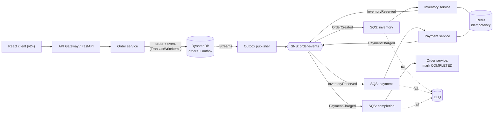

# E-Commerce-AWS-Event-Driven-Project

> A hands-on, incrementally-built POC for learning distributed systems and applied AI.
> It models an e-commerce order flow as **event-driven microservices** that react to each
> other's events (choreography). Built around the **Outbox pattern on DynamoDB**, with
> idempotency, retries and dead-letter queues — and later extended with semantic search
> and AI agents. Everything runs on a laptop via Docker + a local DynamoDB emulator.

<!-- Replace these placeholder badges with real ones once CI is set up. -->


---

## Table of contents

- [Why this project exists](#why-this-project-exists)
- [What problem it solves](#what-problem-it-solves)
- [Scope of v1 (happy path only)](#scope-of-v1-happy-path-only)
- [Architecture](#architecture)
- [Event flow](#event-flow)
- [Concepts covered](#concepts-covered)
- [Tech stack](#tech-stack)
- [Roadmap](#roadmap)
- [Repository structure](#repository-structure)
- [Getting started](#getting-started)
- [Configuration](#configuration)
- [How the core patterns work](#how-the-core-patterns-work)
- [Testing](#testing)
- [How to extend this project](#how-to-extend-this-project)
- [Important tools to install](#important-tools-to-install)
- [License](#license)

---

## Why this project exists

This is a **learning playground**, not a product. It is built in small, shippable
versions (`v1` -> `v5`). Each version runs end-to-end and adds exactly one new layer of
ideas, so you internalise *why* each pattern exists before stacking the next one on top.

If you only read one thing, read [How the core patterns work](#how-the-core-patterns-work).

---

## What problem it solves

A single "Place Order" click hides several steps that live in **separate services**:
reserve inventory, take payment, complete the order. Doing this reliably across services
is hard. This POC demonstrates the standard solutions to three real production problems:

| Problem | What goes wrong | Pattern used |
| --- | --- | --- |
| Dual-write | The DB commits but the event is lost on crash | **Outbox** (on DynamoDB) |
| Double submit | A retry / double-click creates two orders or two charges | **Idempotency** |
| Transient failures | A service is briefly down and the message is dropped | **Retry + DLQ** |

> **Coordination style:** services communicate by reacting to events
> (**choreography**) — there is no central orchestrator. This keeps the POC simple and
> highly decoupled. (A future version may add an orchestrator + compensation to turn this
> into a full saga; see [Roadmap](#roadmap).)

---

## Scope of v1 (happy path only)

v1 deliberately implements **only the happy path**: an order that succeeds end to end.
There is no compensation / rollback logic yet — a message that keeps failing simply lands
in a dead-letter queue for inspection. This is intentional: it keeps the focus on the
event-driven backbone and the Outbox pattern. Failure handling and compensation are a
later concern.

---

## Architecture



Each arrow out of a service is an event it **emits**; the next service simply reacts to it.
No component is "in charge" of the sequence — the sequence emerges from the events.

---

## Event flow

The happy-path chain, end to end:

```
OrderCreated  ->  (Inventory)  ->  InventoryReserved
              ->  (Payment)    ->  PaymentCharged
              ->  (Order svc)  ->  status = COMPLETED
```

All messages share one envelope:

```json
{
  "message_id": "msg_a1",
  "type": "OrderCreated",
  "version": "1.0",
  "occurred_at": "2026-06-23T10:00:00Z",
  "correlation_id": "ord_7f3a",
  "causation_id": "msg_prev",
  "payload": { }
}
```

- `correlation_id` (= the order id) stays constant across every message, so one order's
  full journey is easy to trace.
- `message_id` is unique per message, so consumers can **deduplicate** (every transport
  here is at-least-once).

---

## Concepts covered

Concepts are introduced gradually across versions, not all at once.

**Engineering** — Event-driven architecture · Outbox · Idempotency · Retry ·
Dead-letter queue · CQRS · Checkpointing · Docker · OpenTelemetry · CI/CD · Load testing
*(saga + compensation: optional future version)*

**AWS (emulated locally, real on deploy)** — DynamoDB (+ Streams) · SQS · SNS · Lambda ·
S3 · OpenSearch · API Gateway · ElastiCache · CloudWatch · Elastic Beanstalk

**AI** — Prompt engineering · Tokenization · Embeddings · Vector DB · Semantic search ·
RAG · AI agents · Tool calling · MCP servers · Memory · Guardrails · Structured output ·
LangGraph · AI observability

> See the [Roadmap](#roadmap) for which version introduces each concept.

---

## Tech stack

| Layer | Local (this repo) | Cloud equivalent |
| --- | --- | --- |
| Transactional store | DynamoDB Local *(emulator)* | Amazon DynamoDB |
| Change feed | DynamoDB Streams | DynamoDB Streams |
| Messaging | LocalStack (SNS + SQS) | AWS SNS + SQS |
| Cache + idempotency | Redis | ElastiCache |
| Object storage | MinIO *(v4+)* | S3 |
| Search + vectors | OpenSearch *(v2+)* | Amazon OpenSearch |
| LLM + embeddings | Ollama *(v2+)* | Bedrock / external |
| Services | FastAPI (Docker) | Lambda / Elastic Beanstalk |
| Frontend | React *(v2+)* | — |
| Observability | OpenTelemetry + Jaeger *(v5)* | CloudWatch + X-Ray |

> No relational database is used. The Outbox pattern is built natively on DynamoDB using
> `TransactWriteItems` + Streams.

---

## Roadmap

Each version is independently runnable. Build them in order.

| Version | Adds | New concepts |
| --- | --- | --- |
| **v1** | Event-driven happy path: Order -> Outbox(DynamoDB) -> SNS/SQS -> Inventory -> Payment -> Completed | Event-driven, Outbox, Idempotency, Retry, DLQ |
| **v2** | Product semantic search + React frontend | Tokenization, Embeddings, Vector DB, Semantic search |
| **v3** | Order-support AI agent + MCP tools | RAG, AI agent, Tool calling, Memory, Guardrails, LangGraph |
| **v4** | Shipping + invoices (S3/MinIO) + CQRS read model | CQRS, S3/MinIO |
| **v5** | Observability + load testing + CI/CD | OpenTelemetry, AI observability, Load testing, CI/CD |

> Optional: a dedicated version can reintroduce a **saga orchestrator + compensation** to
> upgrade the happy path into a fully fault-tolerant distributed transaction.

---

## Repository structure

The layout follows clean architecture: each service keeps its business logic (`domain`,
`application`) independent of its infrastructure (`adapters`). Add new services as new
folders under `services/` — nothing else needs to change.

```text
.
├── docker-compose.yml          # local infra: dynamodb, redis, localstack(sns/sqs)
├── .env.example                # copy to .env and adjust
├── README.md
│
├── services/                   # one folder per microservice
│   ├── order-service/          # FastAPI: write (order+outbox tx) + completion handler  (v1)
│   │   ├── app/
│   │   │   ├── domain/         # entities, value objects   (no I/O here)
│   │   │   ├── application/    # use cases / event handlers
│   │   │   ├── adapters/       # dynamodb, sns, sqs, redis implementations
│   │   │   └── api/            # FastAPI routes
│   │   ├── tests/
│   │   ├── Dockerfile
│   │   └── pyproject.toml
│   ├── outbox-publisher/       # reads DynamoDB Streams -> publishes to SNS             (v1)
│   ├── inventory-service/      # consumes OrderCreated -> reserve -> emit Reserved      (v1)
│   └── payment-service/        # consumes InventoryReserved -> charge -> emit Charged   (v1)
│
├── ai/                         # AI layer                                               (v2+)
│   ├── embeddings/             # catalog -> vectors -> OpenSearch
│   ├── support-agent/          # LangGraph agent (RAG + tools + memory)
│   └── mcp-server/             # exposes order tools over MCP
│
├── frontend/                   # React app                                              (v2+)
│
├── libs/                       # shared code (import across services)
│   └── contracts/              # event schemas: OrderCreated, InventoryReserved, ...
│
├── infra/
│   ├── localstack/             # bootstrap: create SNS topic + SQS queues + DLQs
│   └── dynamodb/               # table definitions (orders, outbox) + stream setup
│
├── scripts/                    # verify-env, seed-data, helpers
└── docs/                       # architecture notes, ADRs, diagrams
```

---

## Getting started

### Prerequisites

- Docker + Docker Compose
- Python 3.12+ (only needed when running services outside containers)
- `pip install awscli-local` (gives you the `awslocal` helper for LocalStack)

### 1. Start the local infrastructure

```bash
cp .env.example .env
docker compose up -d
docker compose ps          # dynamodb, redis, localstack should all be "running"
```

### 2. Verify everything is up

```bash
docker compose exec redis redis-cli ping                       # -> PONG

# DynamoDB emulator: list tables (empty list on first run is fine)
aws dynamodb list-tables --endpoint-url http://localhost:8000

# LocalStack (SNS/SQS): create + list a test queue
awslocal sqs create-queue --queue-name test-queue              # -> returns a QueueUrl
awslocal sqs list-queues                                       # test-queue is listed
```

If these checks pass, your local "cloud" is ready.

### 3. Create tables, topic and queues

```bash
bash infra/dynamodb/create-tables.sh     # orders, outbox (with Streams enabled)
bash infra/localstack/bootstrap.sh       # order-events topic + queues + DLQs + filters
```

### 4. Run the services

> Service code lands incrementally. This section will list the exact commands as each
> service is added (e.g. `docker compose up order-service inventory-service`).

---

## Configuration

All settings come from environment variables (see `.env.example`). Two separate emulators
are used, so there are two endpoints:

```python
import boto3, os

# DynamoDB -> the DynamoDB Local emulator
ddb = boto3.client(
    "dynamodb",
    endpoint_url=os.getenv("DYNAMODB_ENDPOINT_URL"),  # http://dynamodb:8000 in Docker
    region_name=os.getenv("AWS_REGION", "us-east-1"),
)

# SNS / SQS -> LocalStack
sns = boto3.client(
    "sns",
    endpoint_url=os.getenv("AWS_ENDPOINT_URL"),        # http://localstack:4566 in Docker
    region_name=os.getenv("AWS_REGION", "us-east-1"),
)
```

To run against real AWS, simply remove the `endpoint_url` arguments — the same code works.

**Networking note:** from your laptop (host) the emulators are at `localhost`. From a
container inside this compose network they are reachable by service name
(`http://dynamodb:8000`, `http://localstack:4566`). Mixing these up is the most common
"connection refused" cause.

| Variable | Example | Notes |
| --- | --- | --- |
| `DYNAMODB_ENDPOINT_URL` | `http://dynamodb:8000` | Remove in real AWS |
| `AWS_ENDPOINT_URL` | `http://localstack:4566` | SNS/SQS; remove in real AWS |
| `AWS_REGION` | `us-east-1` | |
| `REDIS_URL` | `redis://redis:6379/0` | |

---

## How the core patterns work

**Outbox (on DynamoDB)** — The order service writes the order *and* an `OrderCreated`
event in a single `TransactWriteItems` call (order -> `orders` table, event -> `outbox`
table). Either both writes commit or neither does, so an event can never be lost. The
`outbox` table has **Streams** enabled; a separate publisher reads the stream and pushes
each event to SNS, so publishing is decoupled from the write.

**Choreography** — There is no orchestrator. Each service subscribes (via SNS message
filtering) to the one event type it cares about, does its work, and emits the next event.
The order's progression is an emergent chain of events, not a script run by a coordinator.

**Idempotency** — Every order request carries an `Idempotency-Key`, and every event
carries a unique `message_id`. Services store these in Redis, so a retry or a duplicate
delivery is recognised and skipped instead of creating a second order or a second charge.

**Retry + DLQ** — SQS redelivers failed messages a few times. A message that keeps failing
(a "poison" message) is moved to a dead-letter queue so it never blocks the main flow.

---

## Testing

```bash
# Unit tests run with no infra (domain/application are pure)
cd services/order-service && pytest

# Integration tests run against the compose stack
docker compose up -d
pytest tests/integration
```

> Load tests (Locust) and end-to-end tests arrive in `v5`.

---

## How to extend this project

The repo is intentionally easy to grow. Common changes:

- **Add a new service** (e.g. `shipping-service`): copy an existing service folder under
  `services/`, subscribe its queue to the right event type, and emit its own next event.
- **Add a new event**: define its schema once in `libs/contracts/`, then import it
  everywhere. Keeping contracts in one place prevents drift between services.
- **Add an orchestrator later**: introduce a `saga-orchestrator` service that consumes the
  events and issues commands + compensations — without rewriting the existing services.
- **Record a decision**: drop a short note in `docs/` (an ADR — "Architecture Decision
  Record") explaining *why*. Future-you will thank present-you.

Keep the rule of thumb: **business logic in `domain`/`application`, all I/O in
`adapters`.** As long as that holds, swapping emulators for real AWS stays a small, local
change.

---

## Important Tools to Install

There are some important tools to install
1. **LS-Expolorer** (LocalStack Explorer): It is a UI interface which gives you access to interact with your resources inside our LocalStack
```bash
docker run -d --name ls-explorer -p 3001:3001 `
  -e LOCALSTACK_ENDPOINT=http://host.docker.internal:4566 `
  fgiova/localstack-explorer:latest
```

## License

MIT — see `LICENSE`. Use it freely for learning.
